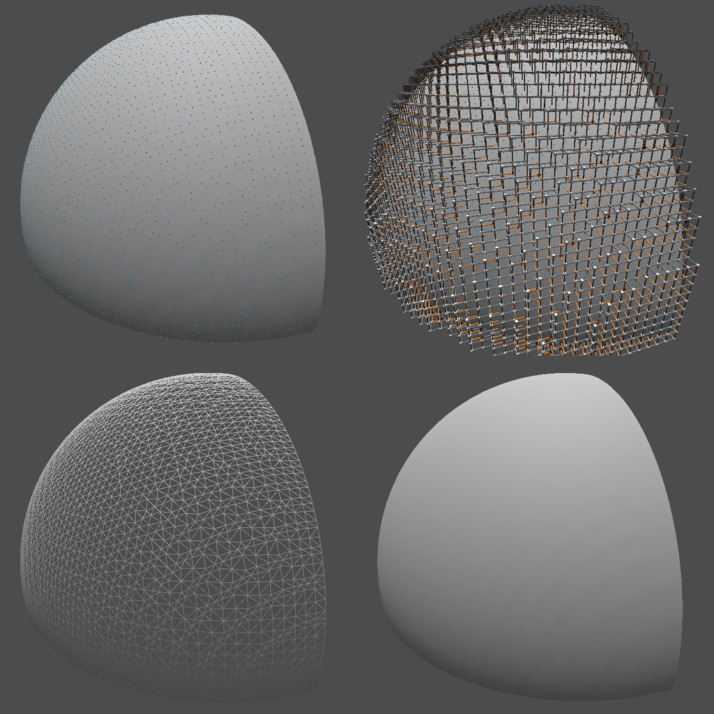
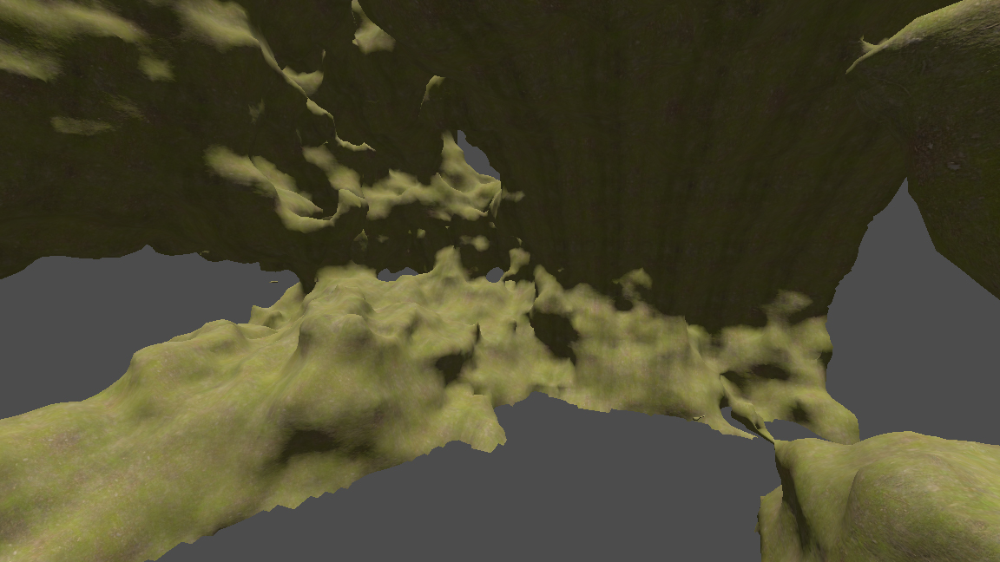

# Dual Contouring 3D

This prototype is entirely written in GDScript with [Godot].
It implements the [Dual Contouring] algorithm (in 3D).

## Features

- Generate chunks of terrain with `FastNoiseLite`.
- Compute voxels per cell.
- Test each edge of a cell if it is crossing the iso-surface, when `density = 0.0`.
- Computes vertex position in a cell (center between crossing edges only, no QEF).
- ~~Spawn two vertices to prevent non-manifold surface when required.~~
- Contour voxels by joining vertices to create quads.
- Compute normals per chunk to seamlessly stitch chunks.
- Smooth mesh using [Delaunay triangulation].

## Known issues

- Compute two vertices per cell to create manifold mesh when required.
- Merge vertices when possible?

## Roadmap

- Improve performance using caching mechanism (like memoize).
- Improve performance using an Octree data structure.
- Generate chunks with different LOD using an Octree data structure.
- Improve performance with a C++ implementation using GDExtension.

## Usage

- Move around the world using Z, Q, S, D and mouse to oriente the camera.
- Press W to toggle wireframe rendering mode.
- Press C to show/hide cell with voxels / edges representation.
- Press P to show/hide points of voxels:
  - draw one vertex per cell (blue dot).
  - ~~draw two vertices per cell, manifold solution (orange dots).~~

## Cheatsheet

This section shows which steps are used to compute Dual Contouring.

### Cells and edges

### Algorithm steps
From left to right, top to bottom:

- One blue dot is a vertex of a cell.
- Each 'box' is a cell with 8 voxels. It is used to test iso-surface crossing and to compute a vertex (previous blue 
  dot).
- Wireframe rendering of the generated mesh. It shows triangles orientation as a result of the Delaunay triangulation.
- Final rendering of the generated mesh with normals generated by SurfaceTool from Godot.

## Screenshots

A set of screenshots to show how this implementation looks like:

### Seed 8735553

<!-- Table of links -->
[Godot]: https://godotengine.org/
[Dual Contouring]: https://www.cs.rice.edu/~jwarren/papers/dualcontour.pdf
[Delaunay triangulation]: https://en.wikipedia.org/wiki/Delaunay_triangulation
